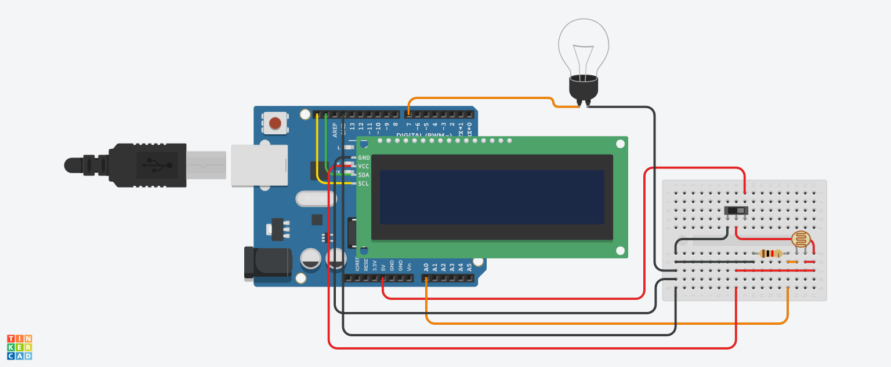

# Light-Sensor
A small light Sensor that turns on a lightbulb when its night.

# Parts needed
Here is a list of the parts needed which in combination with the [Daylight Sensor](resources/Daylight_Sensor.pdf) can be used to rebuild the Daylight Sensor.

|Name|Quantity|Component                                 |
|----|--------|------------------------------------------|
|U1  |1       | Arduino Uno R3                           |
|U2  |1       |MCP23008-based, 32 (0x20) LCD 16 x 2 (I2C)|
|S1  |1       | Slideswitch                              |
|R1  |1       | Photoresistor                            |
|R2  |1       |1 kΩ Resistor                             |
|L1  |1       | Light bulb                               |

# Image
Here is an example of the finished Daylight Sensor

